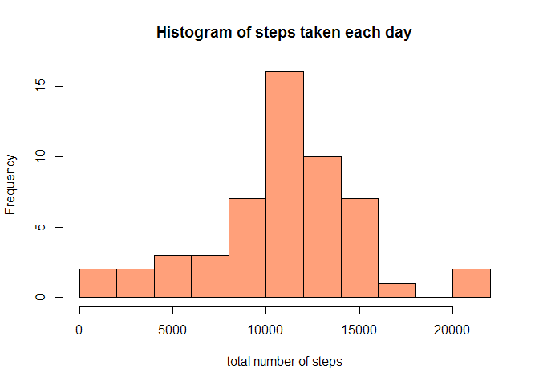
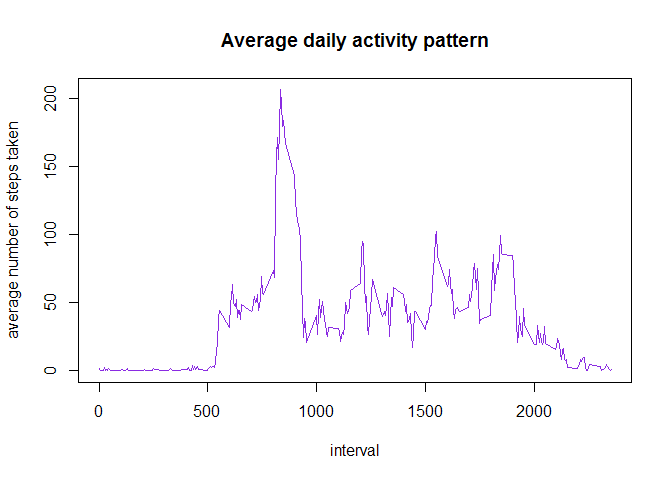
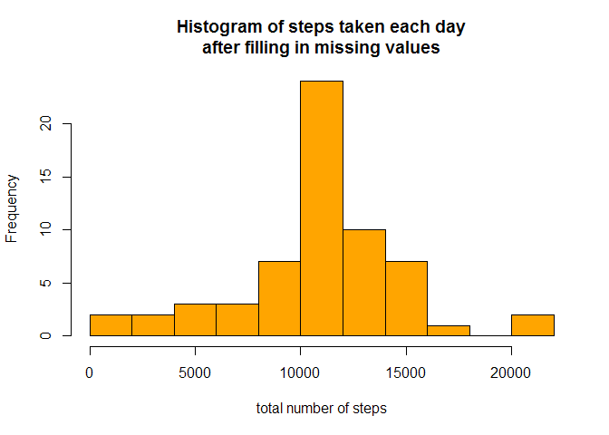
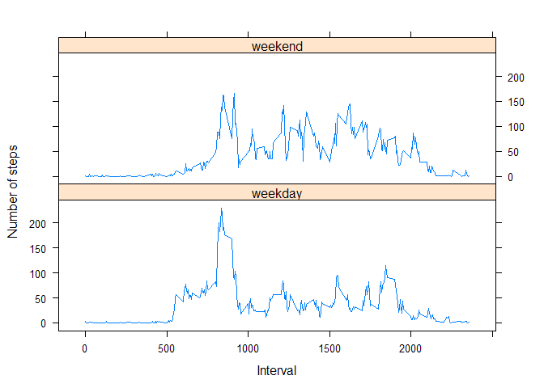

# Reproducible Research: Peer Assessment 1

It is now possible to collect a large amount of data about personal movement using activity monitoring devices such as a Fitbit, Nike Fuelband, or Jawbone Up. These type of devices are part of the “quantified self” movement – a group of enthusiasts who take measurements about themselves regularly to improve their health, to find patterns in their behavior, or because they are tech geeks. But these data remain under-utilized both because the raw data are hard to obtain and there is a lack of statistical methods and software for processing and interpreting the data.

This assignment makes use of data from a personal activity monitoring device. This device collects data at 5 minute intervals through out the day. The data consists of two months of data from an anonymous individual collected during the months of October and November, 2012 and include the number of steps taken in 5 minute intervals each day.

## Loading and preprocessing the data

```r
activity <- read.csv(unz("activity.zip", "activity.csv"))
```

## What is mean total number of steps taken per day?

```r
# Calculate the total number of steps taken per day
total_steps <- aggregate(activity$steps, by=list(activity$date), sum)

# Make a histogram of the total number of steps taken each day
hist(total_steps$x, col ='lightsalmon', xlab='total number of steps', main='Histogram of steps taken each day', breaks=9)
```

 

```r
# Calculate and report the mean and median of the total number of steps taken 
# per day
mean(total_steps$x, na.rm=TRUE)
```

```
## [1] 10766.19
```

```r
median(total_steps$x, na.rm=TRUE)
```

```
## [1] 10765
```


## What is the average daily activity pattern?

```r
#  Make a time series plot (i.e. type = "l") of the 5-minute interval (x-axis) 
# and the average number of steps taken, averaged across all days (y-axis)
average_steps <- aggregate(activity$steps, by=list(activity$interval), mean, na.rm=TRUE)
names(average_steps) <- c('interval', 'steps')
plot(average_steps, type='l', xlab= 'interval', ylab='average number of steps taken', main='Average daily activity pattern', col='blueviolet')
```

 

Which 5-minute interval, on average across all the days in the dataset, contains the maximum number of steps?

```r
average_steps[which.max(average_steps$steps),c('interval')]
```

```
## [1] 835
```


## Imputing missing values

The total number of missing values in the dataset (i.e. the total number of rows with NAs):

```r
sum(is.na(activity$steps))
```

```
## [1] 2304
```

```r
# Create a new dataset that is equal to the original dataset in order to
# fill its missing values
activityComplete <- activity

# Fill in all of the missing values in the new dataset 
# by the the mean for that 5-minute interval
for (i in which(is.na(activityComplete)))
     {
     activityComplete[i,1] <- average_steps$steps[average_steps$interval==activityComplete[i,3]]
     }

# Make a histogram of the total number of steps taken each day.
total_steps <- aggregate(activityComplete$steps, by=list(activityComplete$date), sum)
hist(total_steps$x, col ='orange', xlab='total number of steps', main='Histogram of steps taken each day\nafter filling in missing values', breaks=9)
```

 

```r
# Calculate 
# and report the mean and median total number of steps taken per day. 
mean(total_steps$x, na.rm=TRUE)
```

```
## [1] 10766.19
```

```r
median(total_steps$x, na.rm=TRUE)
```

```
## [1] 10766.19
```

*The mean and median values don't differ from the estimates from the first part of the assignment.
Imputing missing data increases the total number of steps because the number of valid samples has increased, and so the frequency for total steps per day has also increased. (as seen in the histograms). Still the 2 histograms have a similar shape, and the mean and median are practicaly identical.*

## Are there differences in activity patterns between weekdays and weekends?


```r
# Create a new factor variable in the dataset with two levels – “weekday” and 
# “weekend” indicating whether a given date is a weekday or weekend day.
library(lubridate)
activityComplete$DayFac <- ifelse(wday(as.Date(activityComplete$date))%in% c(1,7), "weekend", "weekday")

# Make a panel plot containing a time series plot (i.e. type = "l") of the 5
# -minute interval (x-axis) and the average number of steps taken, averaged 
# across all weekday days or weekend days (y-axis). 
average_steps <- aggregate(steps~ interval+DayFac, data=activityComplete, mean, na.rm=TRUE)
names(average_steps) <- c('interval','day', 'steps')
library(lattice)
with (average_steps, 
      xyplot(steps ~ interval|day, type="l", xlab="Interval",
             ylab="Number of steps",layout=c(1,2)))
```

 

*Results : Weekdays and Weekends have different daily activity patterns. During the weekends the activity is more spread, while in the weekdays there is a much higher rate of activity during a narrow time interval.* 
